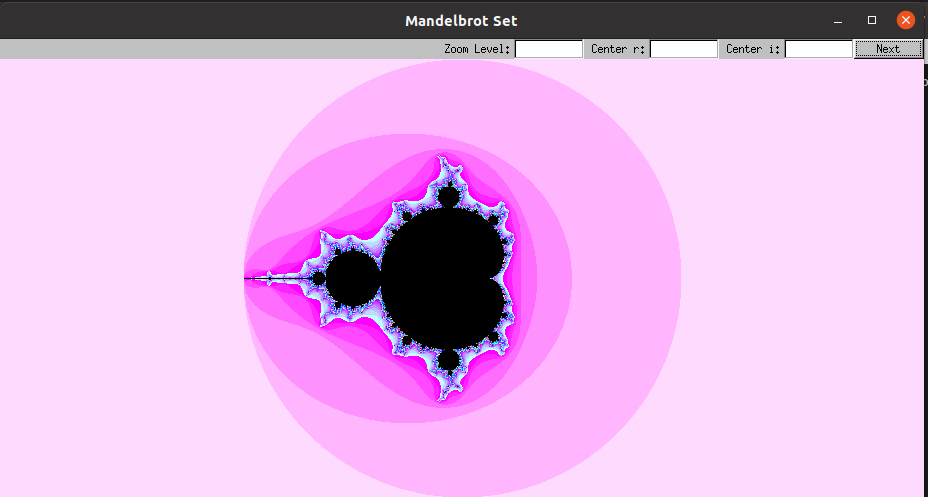

# Mandelbrot Set Visualization

## Overview

This C++ program provides a graphical visualization of the Mandelbrot set, allowing users to explore its intricate patterns interactively. The project utilizes the FLTK (Fast, Light Toolkit) library for the graphical user interface.

## Features

- **User Interaction:** The program presents a graphical window with text box inputs, enabling users to dynamically adjust the center coordinates and zoom level for exploring different regions of the Mandelbrot set.

- **Efficient Pixel Mapping:** The `ComplexPlane` class efficiently maps pixel coordinates to complex plane coordinates, determining the Mandelbrot set membership and generating a pixel buffer for visualization.

- **Color Mapping:** Colors are assigned to pixels based on the iteration count, providing a visually appealing representation of the Mandelbrot set.

## How to Use

1. **Compile the Code:**
   - Compile the program using the provided source files: `main.cpp`, `ZoomWindow.cpp`, `ComplexPlane.cpp`.

2. **Run the Executable:**
   - Execute the compiled program to launch the Mandelbrot set visualization window.

3. **Interactive Exploration:**
   - Use the text box inputs to adjust the center coordinates and zoom level.
   - Click the "Next" button to update the image and explore different regions of the Mandelbrot set.

## Implementation

The implementation includes two main classes:
- **ZoomWindow:**
  - Manages the graphical window interface.
  - Allows users to input center coordinates and adjust the zoom level.

- **ComplexPlane:**
  - Represents the complex plane and handles pixel buffer generation.
  - Utilizes FLTK functions for efficient drawing and color mapping.

## Explore the Beauty of Mathematics

Feel free to experiment with different parameters, discover mesmerizing visualizations, and delve into the beauty of the Mandelbrot set.

